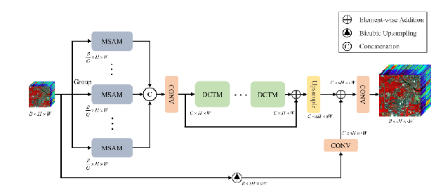
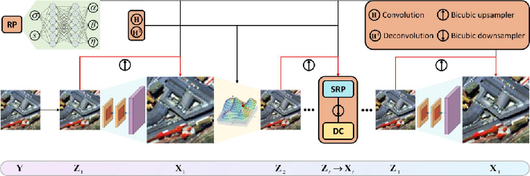
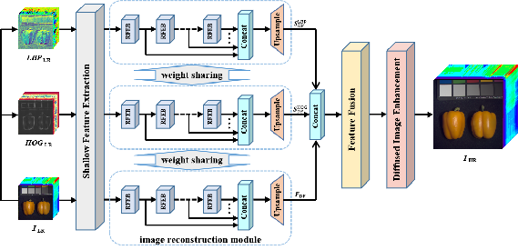

# Overview of Hyperspectral Image Super-Resolution Models

## MSDformer
**MSDformer**, or Multiscale Deformable Transformer, is designed for hyperspectral image super-resolution. This model leverages a transformer-based architecture that adapts to different scales and deformations in the hyperspectral images. The process involves multiple stages, including:

- **Convolution and Deconvolution**: These operations help in manipulating the spatial resolution of the images.
- **Bicubic Upsampler and Downsampler**: These components are used for scaling the images up and down respectively, aiding in the transformation process.
- **MSAM (Multi-Scale Attention Module)**: This module focuses on different scales of the input to capture various details.
- **DCTM (Deformable Convolutional Transformer Module)**: It integrates deformable convolution with transformers to handle spatial deformations effectively.

The architecture diagram shows a sequence of operations starting from an input image, passing through various transformation stages, and finally outputting the super-resolved image.

## EUNet
**EUNet**, or Efficient Unfolding Network, focuses on disentangled spatial-spectral representation for hyperspectral image super-resolution. The model's architecture is designed to efficiently unfold the image processing steps into a network structure, which includes:

- **Feature Extraction**: Initial extraction of features using spatial and spectral information.
- **Weight Sharing**: To reduce the computational load, EUNet uses weight sharing across different layers.
- **Image Reconstruction Module**: This module reconstructs the image from the extracted features, ensuring high-quality super-resolution.

EUNet's design is particularly noted for its efficiency and effectiveness in handling both spatial and spectral dimensions of hyperspectral images.

## DCNN
**DCNN**, or Diffused Convolutional Neural Network, is another model aimed at hyperspectral image super-resolution. It is characterized by:

- **High GPU Memory Requirement**: Due to its intensive computational needs, DCNN requires significant GPU resources.
- **Diffused Convolutional Approach**: This approach helps in handling the high variability and complexity of hyperspectral images.

DCNN is suitable for scenarios where high computational resources are available, and high-resolution enhancement is critical.

---

Each of these models offers unique advantages and is suited for different application needs in the field of hyperspectral image processing. The choice of model would depend on the specific requirements such as resolution enhancement, computational resources, and specific characteristics of the hyperspectral images to be processed.